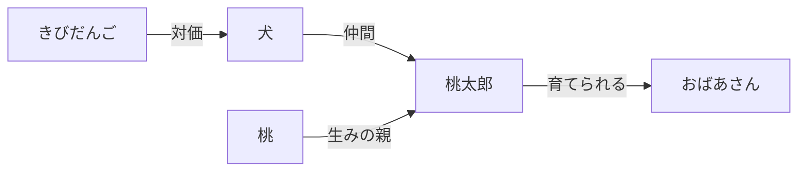
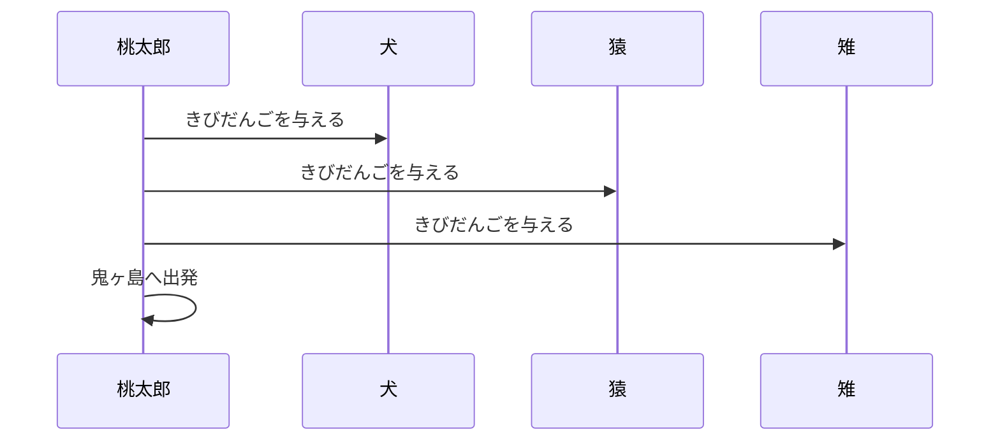

# momotaro

Specification IR ハンズオンの最初の題材。日本の昔話「桃太郎」を形式モデルで表現し、
**図に投影して人間のメンタルモデルを構築・検証する** ことを目的とする。

このアプリは「既存の物語(=既存コード相当の事実源)→ 形式モデル → 図への投影 →
人間のメンタルモデルとの照合」というセマンティック・リバースエンジニアリングの
ドライランである。誰もが筋を知っている物語を題材にすることで、モデルが事実源と
合っているかどうかを人間が即座に判定できる。

## 全体のながれ

```text
事実源(物語)
   │  形式化
   ▼
形式モデル(Specification IR)
   ├── CUE   : 構造・語彙・関係(静的に保証できること)
   └── Quint : 状態遷移・不変条件(時間とともに変化する振る舞い)
   │  projection
   ▼
図(概念マップ / シーケンス図)
   │  照合
   ▼
人間のメンタルモデル ── 食い違いを見つけたらモデルを修正して再び投影する
```

図は鑑賞物ではなく、**人間がモデルを事実源と照合するための照合面**である。
メンタルモデルの構築は、この「投影 → 照合 → 修正」の反復によって進む。

## 構成

```text
spec/
├── schema.cue      #Character / #Relation / #Item のスキーマ定義
├── characters.cue  登場人物データ(桃太郎・おじいさん・おばあさん・犬・猿・雉・鬼)
├── items.cue       アイテムデータ(桃・きびだんご)
├── vocabulary.cue  日本語呼称の一意性レジストリ・参照整合性検査・relations自動生成
├── momotaro.qnt    振る舞いモデル(状態遷移・不変条件)
└── constants.qnt   CUEのknownIdsから生成されたQuint用定数(手編集禁止)
```

---

## 構造の層(CUE)

「登場人物・アイテムは何か、どう繋がっているか」という**静的な構造**を担当する。

`cue vet -c ./apps/momotaro/spec` で次を機械検査する。

1. **構造** — `kind` は enum、型不一致・必須フィールド欠落を検出
2. **語彙の一意性** — 日本語呼称が stable id に一意に対応する(重複は検証失敗)
3. **参照整合性** — `relations` の target は既知エンティティの id を指す

| 機能 | 実装 |
|---|---|
| スキーマ検証 | 型・enum・必須フィールド欠落を `cue vet -c` で検出 |
| 語彙の一意性強制 | 日本語呼称を構造体キーにし、重複した瞬間 unification が衝突して失敗 |
| 呼称↔idの自動辞書 | `vocabulary` を `characters`/`items` から comprehension で生成(二重管理なし) |
| 参照整合性 | `relations.target` が未知のidを指すと、誰の・何番目の・関係が・誰を指し損ねたかをエラーパスに載せて失敗 |
| 人間向けメタ情報 | `@ja(...)` 属性でフィールドの日本語呼称をASTに保持(データを汚さない) |

---

## 振る舞いの層(Quint)

「物語がどう進行するか」という**時間とともに変化する振る舞い**を担当する。
`spec/momotaro.qnt` が桃太郎の全弧(序章→きびだんご経済→戦闘→結末)を状態遷移として表現する。

### 状態と遷移

| 要素 | 表現 |
|---|---|
| 序章 | `prologueStep`(整数)で 桃が流れる→拾う→生まれる→育つ→旅立つ の5段階 |
| きびだんご経済 | `give` が「だんご1個 ⇔ 仲間1人」の交換。`nondet` で出会う動物を非決定的に選択 |
| 出会い順 | `prereqs` が犬→猿→雉の固定順を強制。逆順・順序飛ばしは不成立 |
| 戦闘 | `defeatOni`(仲間1人以上で勝利)/ `defeatedByOni`(仲間なしで敗北)。勝敗が仲間数に依存 |
| 結末 | `claimTreasure`(勝利後に宝物奪還)/ `returnHome`(宝物を持って帰還) |

### 不変条件(毎ステップ検査される性質)

| invariant | 意味 |
|---|---|
| `DangoNonNegative` | だんごは常に0個以上 |
| `DangoOnlyDuringJourney` | だんごを持てるのは旅立ち後のみ |
| `CompanionsAtMostThree` | 仲間は3匹まで |
| `NeverWinWithoutCompanions` | 勝利したなら仲間が1人以上いる |
| `WinLoseExclusive` | 勝利と敗北は同時に成立しない |
| `TreasureRequiresVictory` | 宝物は鬼を退治した後でしか得られない |
| `ReturnRequiresTreasure` | 帰還は宝物を得た後でしか起きない |

「仲間なしでは鬼に勝てない」(`NeverWinWithoutCompanions`)は、出発を仲間の人数で
縛っていないため、仲間0人の反実仮想も探索した上で勝利を禁じる**空虚でない制約**である。
制約を意図的に外すと `quint verify` が「仲間0人で勝利する」違反トレースを検出する
(ミューテーションテスト)。

### 序章を整数段階で表現する理由

`check-consistency` は「.qnt 内の文字列リテラルはCUEの既知idでなければならない」と
検査する。物語の段階(`"floating"` など)はエンティティではなくCUEの語彙に載せないため、
そのままでは未知idとして拒否される。そこで序章の段階は整数+定数名
(`PHASE_PEACH_FLOATING` 等)で表現している。

---

## Projection(メンタルモデル構築の中心)

モデルから図を生成し、人間が頭の中の物語と照合するための手順。**このアプリの主目的は
ここにある。** 構造と振る舞いで2種類の図を使い分ける。

| 図 | 元 | ツール | 見せてくれるもの |
|---|---|---|---|
| 概念マップ | CUE(構造) | `gen-mermaid-diagram` | 何が存在し、どう繋がっているか |
| シーケンス図 | Quint(振る舞い) | `project` | 時間に沿って何が起きるか |

すべての図の表示語彙(登場人物名・関係名)はCUEの `vocabulary` /
`relationTypeLabels` から解決されるため、図と会話とモデルで用語が一致する。

振る舞いの図の意味づけ(どの状態変化が「与える」で、誰から誰へか)は
`spec/projection.cue` に宣言する。ツールは汎用の機械で、この宣言を評価するだけである。

### 1. 概念マップ(構造のメンタルモデル)

登場人物・アイテムをノードに、関係をラベル付きエッジにした `graph LR` を出す。

```sh
tools/gen-mermaid-diagram apps/momotaro/spec
```

出力例:



「誰が誰とどんな関係か」を一望するための図。新しい概念や関係をCUEに足したら
再生成して、繋がりが意図どおりかを確認する。

### 2. シーケンス図(振る舞いのメンタルモデル)

`quint` の実行トレースから、時間に沿った相互作用を `sequenceDiagram` で出す。
トレースの取得方法で**3つのモード**がある。

| モード | 意味 | コマンド |
|---|---|---|
| 観測(既定) | モデルが**許している振る舞いの標本** | `tools/project <spec>` |
| 宣言 | モデルに**期待している振る舞い** | `tools/project <spec> --test <テスト名>` |
| 任意トレース | 特定のトレース(counterexample等) | `tools/project <spec> --trace <itfファイル>` |

**観測モード** — 内部で `quint run` を実行してランダムなトレースを得る。利用者は
`<specパス>` を渡すだけでよい。

```sh
tools/project apps/momotaro/spec
```

**宣言モード** — `quint test` の特定のシナリオ(例: 物語の通し)をそのまま図にする。
「モデルにこうあってほしい」と宣言した筋が正しく描かれるかを確認する。

```sh
tools/project apps/momotaro/spec --test fullStoryTest
```

出力例( `--test fullStoryTest` ):



**任意トレースモード** — あらかじめ ITF 形式のトレースファイルを用意し、それを図にする。
`quint verify` が違反を見つけたときの counterexample を可視化するのに使う。

```sh
artifact_root="keaton_$(date +%Y%m%d%H%M%S)"
mkdir "$artifact_root" && mkdir "$artifact_root/tmp"
quint run apps/momotaro/spec/momotaro.qnt --max-steps 12 --n-traces 1 --out-itf "$artifact_root/tmp/trace.itf.json"
tools/project apps/momotaro/spec --trace "$artifact_root/tmp/trace.itf.json"
```

**オプション**

| オプション | 効果 |
|---|---|
| `--seed <値>` | 再現性を固定する。同じseedなら同じ図が出る |
| `--max-steps <n>` | 探索するステップ数(既定6)。序章を含む全弧を描くには大きめにする |

序章は状態を前に進めるだけできびだんごの授受を含まないため、シーケンス図には
旅立ち以降の相互作用だけが描かれる。

### 3. 照合の手順(メンタルモデルを構築・修正するループ)

1. **投影する** — 上のいずれかのコマンドで図を出す
2. **照合する** — 図を、自分が知っている物語(事実源)と突き合わせる
3. **食い違いを探す** — 図に現れた「事実源と異なる振る舞い」がモデルの穴である
4. **塞ぐ** — Quint に制約(遷移の前提・不変条件)を追加する
5. **再投影して確認する** — 穴が塞がると、観測モードの図が安定する

**投影の安定は、穴が塞がったことの機械的な証拠になる。**
モデルが複数の振る舞いを許しているほど、観測モードは実行ごとに違う図を出す。
制約を追加して許される経路を絞ると、何回投影しても同じ図しか出なくなる。

> 実例: 出会い順を制約していなかった頃、観測モードは「雉が最初に来る」図を普通に
> 出力した。事実源では犬→猿→雉が固定なので、これは穴である。`give` に
> 「先行する動物が全員すでに仲間であること」(`prereqs`)の制約を追加すると、
> 観測モードは何回実行しても先頭が「犬」の安定した図を出すようになった。

観測モード(許している振る舞い)と宣言モード(期待している振る舞い)を並べて見る
ことで、「モデルが実際に何を許しているか」と「どうあってほしいか」の差が明確になる。

---

## 検証(一通りのコマンド)

```sh
# 構造(CUE)
cue vet -c ./apps/momotaro/spec

# 語彙整合(CUE ↔ Quint)
tools/check-consistency apps/momotaro/spec

# 振る舞い(Quint)
quint typecheck apps/momotaro/spec/momotaro.qnt
quint test apps/momotaro/spec/momotaro.qnt
quint verify apps/momotaro/spec/momotaro.qnt \
  --invariant DangoNonNegative,DangoOnlyDuringJourney,CompanionsAtMostThree,NeverWinWithoutCompanions,WinLoseExclusive,TreasureRequiresVictory,ReturnRequiresTreasure
```

CI想定: `cue vet -c` → `quint typecheck` → `check-consistency` → `quint test`。

`quint verify` は `--invariant` を明示しないと invariant を検査せず
**deadlock のみ検査する**点に注意。宣言した全 invariant をカンマ区切りで渡すこと。

## 日本語呼称の運用

会話と図では日本語呼称を使い、データ上の identity は stable id が持つ。
呼称と id の対応は `vocabulary` として `characters` / `items` から自動生成され、
同じ呼称に複数の id が割り当てられた時点で検証が失敗する。

```sh
cue export ./apps/momotaro/spec -e vocabulary
```

## 設計の約束

- **CUEが語彙の原本**。Quint・図・ドキュメントはCUEから生成・検査される側
- **Quintは生文字列・日本語を書かない**。CUEから生成された `constants.qnt` の定数を使う
- **stable id と表示名を分離する**。名前が変わっても identity は変わらない

## 既知の限界

| 限界 | 内容 |
|---|---|
| 関係性の横断検査 | `check-consistency` は語彙の一致を検査するが、CUEの `relations` 宣言と Quintの振る舞いで行使される関係の diff(宣言済みだが未行使等)はまだ検査しない |
| specの網羅性 | `relations` は「仲間形成と対価」の観点での選択的宣言であり、物語の全関係を網羅しない(健全だが完全ではない) |
