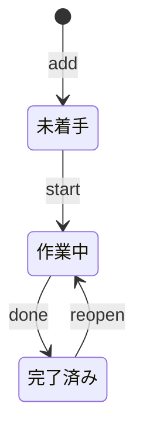

# TODO CLI

TODO CLI は、タスクの状態遷移を検証し、作業ディレクトリの JSON ファイルへ保存する Bun 製のコマンドラインアプリケーションです。

各タスクは、削除後も再利用しない正整数の ID、タイトル、状態、作成時刻、完了時刻を持ちます。
完了時刻は `done` のタスクだけが持ちます。

## セットアップ

Bun をインストールした環境で、アプリケーションのディレクトリへ移動して依存関係をインストールします。

```sh
cd apps/todo-cli
bun install
```

以降の例では、`bun run todo` をコマンドとして使います。

## タスクの状態

タスクは次の順序で進みます。

```text
backlog --start--> active --done--> done
                        <--reopen--
```

`start` は `backlog`、`done` は `active`、`reopen` は `done` のタスクだけに実行できます。
許可されていない状態遷移と、存在しないタスクへの操作は、エラーメッセージを標準エラー出力へ書き、非ゼロの終了コードを返します。

`rm` は既存のタスクを状態に関係なく削除します。
削除後も次回 ID は巻き戻らないため、削除したタスクの ID は再利用されません。

## コマンド

タスクを追加します。
引用符を使うと、空白を含むタイトルを一つの引数として渡せます。

```sh
bun run todo add "READMEを更新する"
```

タスクの一覧を表示します。
`--status` を指定すると、`backlog`、`active`、`done` のいずれかで絞り込めます。

```sh
bun run todo list
bun run todo list --status active
```

一件の詳細を表示し、状態を進めます。

```sh
bun run todo show 1
bun run todo start 1
bun run todo done 1
bun run todo reopen 1
```

タスクを削除します。

```sh
bun run todo rm 1
```

## 保存先

既定では、コマンドを実行した作業ディレクトリの `.todo.json` を使います。
`--file` で別のパスを指定できます。

```sh
bun run todo --file ./data/tasks.json list
bun run todo --file ./data/tasks.json add "永続化を確認する"
```

保存ファイルが存在しない場合は、最初の変更コマンドで新規作成します。
既存ファイルが JSON として壊れている場合や、タスクの状態と完了時刻が矛盾している場合は、ファイルを上書きせずエラーを返します。

## テスト

状態遷移、ID の非再利用、JSON の読み書き、CLI の終了コードを `bun:test` で検査します。

```sh
bun test
```

型検査は次のコマンドで実行します。

```sh
bun run typecheck
```

## 形式モデルと投影

`spec/` には、このアプリケーションの振る舞いをリバースエンジニアリングした
形式モデル(Specification IR)があります。CUE が構造と語彙を、Quint が状態遷移と
不変条件を担当します。実装とは独立に、モデルだけで性質を検証できます。

```sh
cue vet -c ./apps/todo-cli/spec          # CUEの構造検証
quint test apps/todo-cli/spec/todo.qnt   # Quintのシナリオテスト
```

### 投影

Quint の実行トレースを図に投影し、実装の振る舞いと照合します。
TODO CLI はナラティブ(参加者間の相互作用)ではなくレコード上の状態機械なので、
シーケンス図ではなく**状態図**を使います。これは汎用投影ツール `tools/project`
によって実現され、意味づけ(どの状態変化がどの遷移か)は `spec/projection.cue`
に宣言されています。

| モード | 意味 | コマンド |
|---|---|---|
| 観測(既定) | モデルが**許している振る舞いの標本** | `tools/project apps/todo-cli/spec` |
| 宣言 | モデルに**期待している振る舞い** | `tools/project apps/todo-cli/spec --test <テスト名>` |
| 任意トレース | 特定のトレース | `tools/project apps/todo-cli/spec --trace <itfファイル>` |

`add → start → done → reopen` の全シナリオを投影する例:

```sh
tools/project apps/todo-cli/spec --test reopenTaskTest
```



状態の表示名(未着手/作業中/完了済み)は CUE の `vocabulary` から解決されるため、
図と会話とモデルで用語が一致します。`--format json` を付けると、形式に依存しない
イベント列(投影の中間表現)を得られます。
